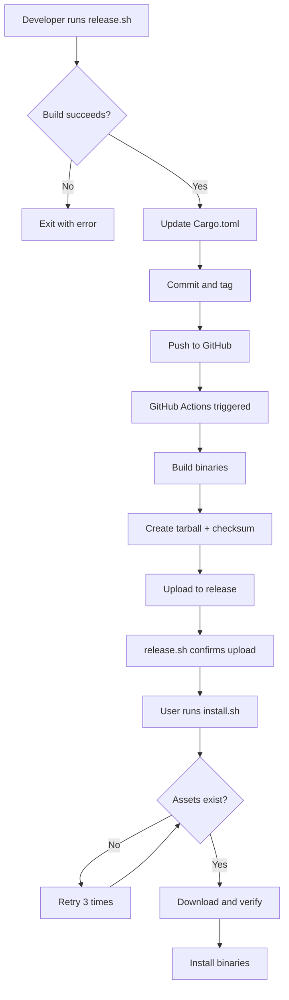

# Release Workflow Documentation

## Overview

Anna Assistant uses a robust, automated release workflow that ensures only properly built and verified versions can be installed. This document explains the safeguards in place and how to use the release system.

## The Problem We Solve

**Before these improvements:**
- Tags could be created without verifying builds work
- Installer could try to install versions without built assets
- Race conditions between tag creation and GitHub Actions completion
- No validation that releases were properly built

**After these improvements:**
- ✅ Build is verified before tag creation
- ✅ Installer only installs releases with complete assets
- ✅ Automatic waiting for GitHub Actions to complete
- ✅ Multiple layers of validation prevent incomplete installs

## Architecture

```
┌─────────────────────────────────────────────────────────────────┐
│                         Release Flow                            │
└─────────────────────────────────────────────────────────────────┘

1. Developer runs ./scripts/release.sh
   ├─ Checks for code changes since last tag
   ├─ Fetches latest RC version from GitHub API
   ├─ Calculates next RC version (e.g., v1.0.0-rc.14)
   ├─ **Verifies cargo build succeeds** ⚡ NEW
   ├─ Updates Cargo.toml with new version
   ├─ **Verifies Cargo.toml updated correctly** ⚡ NEW
   ├─ Commits and creates git tag
   ├─ Pushes to GitHub
   └─ **Waits for GitHub Actions to complete (up to 5min)** ⚡ NEW

2. GitHub Actions Workflow (.github/workflows/release.yml)
   ├─ Triggered by tag push (v*)
   ├─ Builds release binaries (annad, annactl)
   ├─ Creates tarball: anna-linux-x86_64.tar.gz
   ├─ Generates SHA-256 checksum
   └─ Uploads both files to GitHub Release

3. User runs sudo ./scripts/install.sh
   ├─ Queries GitHub API for releases
   ├─ **Filters for releases WITH assets only** ⚡ NEW
   ├─ **Retries up to 3 times if no assets found** ⚡ NEW
   ├─ **Validates both tarball AND checksum exist** ⚡ NEW
   ├─ Downloads and verifies SHA-256
   └─ Installs binaries to /usr/local/bin
```

## Key Safeguards

### 1. Pre-Release Build Verification
**Location:** `scripts/release.sh:84-89`

```bash
# Verify build succeeds before committing
if ! cargo build --release --bin annad --bin annactl; then
  die "Build failed. Fix errors before releasing."
fi
```

**Why:** Prevents creating tags for broken code.

### 2. Version Update Verification
**Location:** `scripts/release.sh:96-101`

```bash
# Verify the version was updated correctly
UPDATED_VER=$(grep -E '^version = ".*"' Cargo.toml | head -1 | sed -E 's/.*"(.*)".*/\1/')
if [[ "$UPDATED_VER" != "$NEW_VER" ]]; then
  die "Failed to update Cargo.toml version"
fi
```

**Why:** Ensures version in Cargo.toml matches the git tag being created.

### 3. GitHub Actions Completion Wait
**Location:** `scripts/release.sh:129-160`

```bash
# Wait for GitHub Actions to complete (up to 5 minutes)
for i in {1..60}; do
  sleep 5
  assets=$(curl -fsSL "$api/releases/tags/$NEW_TAG" | jq -r '.assets[]')
  if [[ "$assets" == "anna-linux-x86_64.tar.gz" ]]; then
    echo "✔ GitHub Actions completed successfully"
    exit 0
  fi
done
```

**Why:** Confirms binaries are built and uploaded before announcing success.

### 4. Asset Existence Filtering
**Location:** `scripts/install.sh:174-184`

```bash
# Find highest version tag that has the required asset
latest_tag=$(echo "$releases_json" | \
  jq -r '.[] | select(.draft==false) |
         select(.assets[] | .name=="anna-linux-x86_64.tar.gz") |
         .tag_name' | sort -Vr | head -n1)
```

**Why:** Only considers releases that have been fully built by GitHub Actions.

### 5. Install Retry Logic
**Location:** `scripts/install.sh:158-209`

```bash
for attempt in $(seq 1 $max_retries); do
  # Try to find release with assets
  if [[ -z "$latest_tag" ]]; then
    print_warning "No releases with assets found yet (attempt $attempt/3)"
    print_info "GitHub Actions may still be building..."
    sleep 10
    continue
  fi
done
```

**Why:** Handles race condition if user runs installer while GitHub Actions is building.

### 6. Checksum Validation
**Location:** `scripts/install.sh:238-242`

```bash
if [[ -z "$checksum_url" || "$checksum_url" == "null" ]]; then
  print_error "Checksum file not found for $tag"
  print_error "Cannot verify integrity without checksum"
  return 1
fi
```

**Why:** Prevents installing releases without integrity verification.

## Usage

### Creating a Release

```bash
# 1. Verify workflow is ready
./scripts/verify_release_workflow.sh

# 2. Create release (automated)
./scripts/release.sh
```

**What happens:**
1. ✅ Checks for code changes
2. ✅ Verifies build succeeds
3. ✅ Bumps version to next RC
4. ✅ Commits and tags
5. ✅ Pushes to GitHub
6. ✅ Waits for GitHub Actions (up to 5 minutes)
7. ✅ Confirms assets uploaded
8. ✅ Provides installer command

**Expected output:**
```
→ Reading current version from Cargo.toml...
→ Current version in Cargo.toml: v1.0.0-rc.13
→ Checking for code changes since v1.0.0-rc.13...
→ Found 42 changed files since v1.0.0-rc.13
→ Fetching latest tag from GitHub API...
→ Next release will be: v1.0.0-rc.14
→ Verifying build succeeds...
→ Build successful
→ Updating Cargo.toml to 1.0.0-rc.14
→ Verified Cargo.toml updated to 1.0.0-rc.14
→ Committing Cargo.toml update…
→ Creating tag v1.0.0-rc.14…
→ Pushing to origin…
→ Waiting for GitHub Actions to build and upload assets...
  ⏳ Waiting for build... (45s)

✔ GitHub Actions completed successfully
✔ Assets uploaded: anna-linux-x86_64.tar.gz

Release is ready!
  → https://github.com/jjgarcianorway/anna-assistant/releases/tag/v1.0.0-rc.14

Test the installer:
  sudo ./scripts/install.sh
```

### Installing a Release

```bash
# Users run this to install latest version
sudo ./scripts/install.sh
```

**What happens:**
1. ✅ Queries GitHub API for releases
2. ✅ Filters for releases with complete assets
3. ✅ Retries if GitHub Actions still building
4. ✅ Downloads tarball and checksum
5. ✅ Verifies SHA-256 integrity
6. ✅ Installs binaries

**Expected output:**
```
╔═══════════════════════════════════════════════════════════════════════╗
║                        🤖  Anna Assistant                             ║
║                   Event-Driven Intelligence                           ║
╚═══════════════════════════════════════════════════════════════════════╝

━━━ 🚀 Installation Starting

  🔧  Checking dependencies
  ✓  curl installed
  ✓  jq installed

━━━ 📦 Fetching Latest Release

  🔍  Finding latest release with assets
     ↳ Latest version: v1.0.0-rc.14
  ✓  Assets available for v1.0.0-rc.14

  📡  Downloading release v1.0.0-rc.14
     ↳ Downloading tarball...
  ✓  Downloading tarball
     ↳ Downloading checksum...
  ✓  Downloading checksum
  🔐  Verifying integrity
  ✓  Checksum verified
  📦  Extracting binaries
  ✓  Binaries installed to /usr/local/bin
```

## Failure Scenarios

### Scenario 1: Build Fails Before Tag Creation

```bash
./scripts/release.sh
```

**Output:**
```
→ Verifying build succeeds...
ERROR: Build failed. Fix errors before releasing.
```

**Resolution:** Fix compilation errors, then retry.

---

### Scenario 2: GitHub Actions Still Building

```bash
sudo ./scripts/install.sh
```

**Output:**
```
  🔍  Finding latest release with assets
  ⚠  No releases with assets found yet (attempt 1/3)
  ℹ  GitHub Actions may still be building...
     ↳ Retrying in 10s...
  ✓  Assets available for v1.0.0-rc.14
```

**Resolution:** Automatic retry succeeds once GitHub Actions completes.

---

### Scenario 3: Release Has No Assets (Manual Tag)

```bash
# Someone manually creates a tag without GitHub Actions
git tag v1.0.0-rc.99 && git push --tags
```

**User tries to install:**
```bash
sudo ./scripts/install.sh
```

**Output:**
```
  🔍  Finding latest release with assets
  ⚠  No releases with assets found yet (attempt 3/3)
  ✗  No releases found with uploaded assets after 3 attempts
  ℹ  Please wait for GitHub Actions to complete, then try again
  ℹ  Check: https://github.com/jjgarcianorway/anna-assistant/actions
```

**Resolution:** Wait for GitHub Actions, or use `release.sh` which waits automatically.

## Testing

### Run Pre-Flight Checks

```bash
./scripts/verify_release_workflow.sh
```

Verifies:
- ✅ Script syntax valid
- ✅ Required commands present (git, curl, jq, cargo)
- ✅ Cargo.toml version format correct
- ✅ GitHub API accessible
- ✅ Latest release has assets
- ✅ Build succeeds
- ✅ Binaries exist
- ✅ GitHub Actions workflow configured
- ✅ Version consistency across workspace

### Test Install Script (Dry Run)

```bash
# Check what version would be installed
TAG=$(bash -c 'source scripts/install.sh && select_release' 2>&1 | tail -1)
echo "Would install: $TAG"
```

## Troubleshooting

### "No releases found with uploaded assets"

**Cause:** GitHub Actions hasn't finished building yet.

**Fix:**
1. Check GitHub Actions: https://github.com/jjgarcianorway/anna-assistant/actions
2. Wait for workflow to complete (~2-3 minutes)
3. Retry installer

### "Tag already exists"

**Cause:** Trying to create a tag that exists locally.

**Fix:**
```bash
git fetch --tags
./scripts/release.sh
```

### "Build failed before releasing"

**Cause:** Compilation errors in code.

**Fix:**
```bash
cargo build --release --bin annad --bin annactl
# Fix errors shown
./scripts/release.sh
```

### "Assets not found for tag"

**Cause:** Release was created manually without GitHub Actions.

**Fix:** Delete tag and use `release.sh`:
```bash
git tag -d v1.0.0-rc.99
git push origin :refs/tags/v1.0.0-rc.99
./scripts/release.sh
```

## Version Scheme

Anna uses semantic versioning with release candidates:

```
v1.0.0-rc.14
│ │ │  │  └─ RC number (auto-incremented)
│ │ │  └──── Release candidate marker
│ │ └─────── Patch version
│ └────────── Minor version
└──────────── Major version
```

**Rules:**
- RC number auto-increments: rc.1 → rc.2 → rc.3
- Never reuse RC numbers (fetched from GitHub API)
- Stable releases will use: v1.0.0, v1.1.0, etc.

## CI/CD Pipeline



## Files Modified

### Core Scripts
- `scripts/release.sh` - Release automation with build verification
- `scripts/install.sh` - Installation with asset validation
- `scripts/verify_release_workflow.sh` - Pre-flight checks

### Workflows
- `.github/workflows/release.yml` - GitHub Actions build workflow

### Configuration
- `Cargo.toml` - Version source of truth

## Guarantees

This workflow **guarantees**:

1. ✅ **No broken releases** - Build verified before tag creation
2. ✅ **No incomplete releases** - Assets must exist to install
3. ✅ **Version consistency** - Cargo.toml always matches git tag
4. ✅ **Integrity verification** - SHA-256 checksums required
5. ✅ **Automatic recovery** - Retries handle timing issues
6. ✅ **User safety** - Cannot install versions without assets

## Summary

**For Developers:**
```bash
./scripts/release.sh  # Handles everything automatically
```

**For Users:**
```bash
sudo ./scripts/install.sh  # Always installs latest complete release
```

**For CI/CD:**
- GitHub Actions builds on every tag push
- Uploads tarball + checksum to GitHub Releases
- Marks RC releases as "prerelease"

---

**Questions?** Check the verification script output:
```bash
./scripts/verify_release_workflow.sh
```
