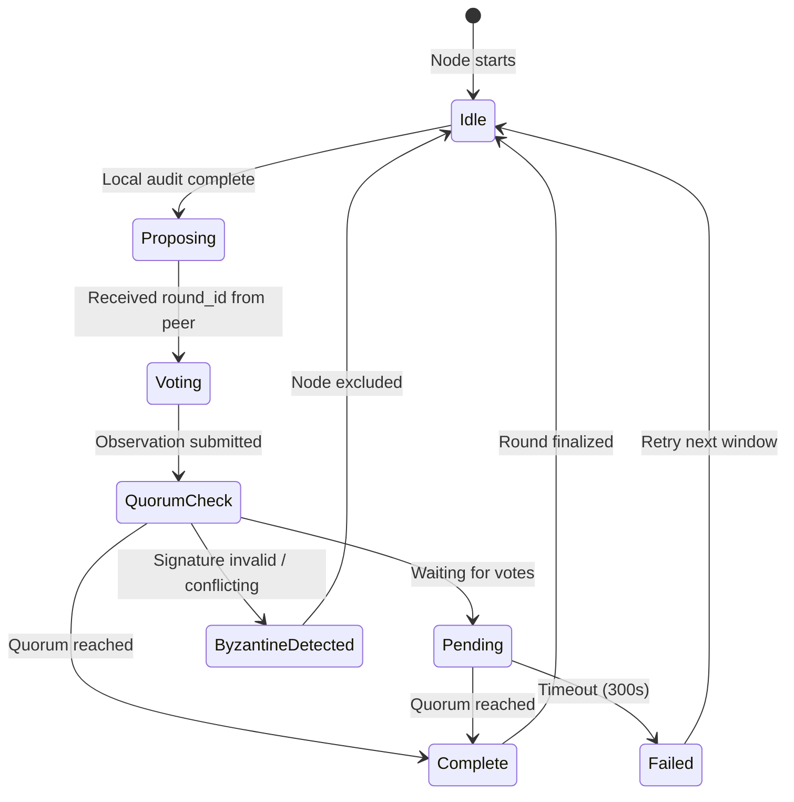

# Phase 1.7: Distributed Audit Consensus

**Version**: 1.7.0-alpha.1
**Status**: Design Document
**Date**: 2025-11-12
**Prerequisites**: Phase 1.6 Mirror Audit and Temporal Self-Reflection

---

## Executive Summary

Phase 1.7 introduces distributed consensus for temporal integrity audits across multiple Anna nodes. This enables:

- **Multi-node verification**: Nodes verify each other's forecasts and mirror audits
- **Consensus TIS scoring**: Quorum-based agreement on Temporal Integrity Scores
- **Byzantine fault tolerance**: Detection and exclusion of misbehaving nodes
- **Cryptographic integrity**: Ed25519 signatures on all audit observations
- **Advisory-only preservation**: Consensus outputs recommendations only, never auto-applies

**Non-Goals**:
- Full Byzantine consensus (BFT) protocol - using simple quorum majority
- Real-time consensus (batch-based with configurable windows)
- Leader election (static peer configuration)
- Dynamic peer discovery (manual peer list configuration)

---

## Table of Contents

1. [Architecture](#architecture)
2. [Consensus Model](#consensus-model)
3. [Message Schemas](#message-schemas)
4. [State Transitions](#state-transitions)
5. [Cryptographic Model](#cryptographic-model)
6. [Network Protocol](#network-protocol)
7. [Error Modes](#error-modes)
8. [Threat Model](#threat-model)
9. [Implementation Plan](#implementation-plan)

---

## Architecture

### Component Overview

```
┌─────────────────────────────────────────────────────────────┐
│                      Anna Node A                            │
│  ┌──────────────┐    ┌──────────────┐   ┌───────────────┐  │
│  │  Chronos     │───▶│ Mirror Audit │──▶│  Consensus    │  │
│  │  (Forecast)  │    │  (Local TIS) │   │  (Propose)    │  │
│  └──────────────┘    └──────────────┘   └───────┬───────┘  │
│                                                   │          │
└───────────────────────────────────────────────────┼──────────┘
                                                    │
                            ┌───────────────────────┼───────────┐
                            │   Consensus Network   │           │
                            │   (Ed25519 signed)    │           │
                            └───────────────────────┼───────────┘
                                                    │
┌───────────────────────────────────────────────────┼──────────┐
│                      Anna Node B                  │          │
│  ┌──────────────┐    ┌──────────────┐   ┌────────▼──────┐   │
│  │  Chronos     │───▶│ Mirror Audit │──▶│  Consensus    │   │
│  │  (Forecast)  │    │  (Local TIS) │   │  (Vote)       │   │
│  └──────────────┘    └──────────────┘   └───────────────┘   │
└─────────────────────────────────────────────────────────────┘
```

### Subsystems

1. **Consensus Engine** (`crates/annad/src/consensus/mod.rs`)
   - Quorum calculation
   - Round management
   - Byzantine detection
   - Adjustment recommendation aggregation

2. **Cryptographic Layer** (`crates/annad/src/consensus/crypto.rs`)
   - Ed25519 key generation and storage
   - Signature creation and verification
   - Hash computation (SHA-256)

3. **Network RPC** (`crates/annad/src/consensus/rpc.rs`)
   - Observation submission
   - Status queries
   - Reconciliation requests

4. **State Persistence** (`crates/annad/src/consensus/state.rs`)
   - Extended mirror audit state (schema v2)
   - Consensus round history
   - Validator signatures

---

## Consensus Model

### Quorum Majority

- **Quorum**: `⌈(N + 1) / 2⌉` where N = total nodes
- **Agreement**: Observation accepted if `votes >= quorum`
- **TIS consensus**: Median TIS across accepted observations
- **Bias consensus**: Bias flagged if reported by `>= quorum` nodes

### Round Structure

```rust
pub struct ConsensusRound {
    pub round_id: String,          // UUID v4
    pub window_hours: u64,         // Audit window
    pub started_at: DateTime<Utc>, // Round start
    pub observations: Vec<AuditObservation>,
    pub status: RoundStatus,       // Pending, Complete, Failed
    pub consensus_tis: Option<f64>,
    pub consensus_biases: Vec<BiasKind>,
}

pub enum RoundStatus {
    Pending,     // Collecting observations
    Complete,    // Quorum reached
    Failed,      // Timeout or Byzantine detected
}
```

### Timeline

```
T0: Round initiated (one node broadcasts round_id)
  ↓
T1-T5: Nodes submit signed observations
  ↓
T6: Quorum check (N/2 + 1 observations?)
  ↓
  ├─ YES → Compute consensus TIS (median)
  │         Aggregate biases (quorum threshold)
  │         Generate advisory adjustments
  │         Round status: Complete
  │
  └─ NO  → Round status: Pending (wait for timeout)
           Timeout (T=300s) → Round status: Failed
```

---

## Message Schemas

### AuditObservation

```rust
pub struct AuditObservation {
    // Identity
    pub node_id: String,           // Ed25519 public key fingerprint
    pub audit_id: String,          // UUID v4 - unique audit identifier
    pub round_id: String,          // UUID v4 - consensus round

    // Temporal window
    pub window_hours: u64,         // Hours of historical audits analyzed
    pub timestamp: DateTime<Utc>,  // When observation was created

    // Forecast data (hashed for integrity)
    pub forecast_hash: String,     // SHA-256(forecast_id || predicted_metrics)
    pub outcome_hash: String,      // SHA-256(forecast_id || actual_metrics)

    // Local TIS computation
    pub tis_components: TISComponents,
    pub tis_overall: f64,

    // Bias detection
    pub bias_flags: Vec<BiasKind>,

    // Cryptographic proof
    pub signature: Vec<u8>,        // Ed25519 signature over canonical encoding
}

pub struct TISComponents {
    pub prediction_accuracy: f64,  // 1.0 - MAE
    pub ethical_alignment: f64,    // Ethical trajectory score
    pub coherence_stability: f64,  // Network coherence delta
}
```

**Canonical Encoding** (for signing):
```
node_id || audit_id || round_id || window_hours || timestamp_unix ||
forecast_hash || outcome_hash ||
tis_overall || prediction_accuracy || ethical_alignment || coherence_stability ||
bias_flags_sorted_csv
```

### ConsensusResult

```rust
pub struct ConsensusResult {
    pub round_id: String,
    pub status: RoundStatus,
    pub participating_nodes: Vec<String>,  // node_id list
    pub total_observations: usize,
    pub required_quorum: usize,

    // Consensus outputs
    pub consensus_tis: Option<f64>,        // Median TIS
    pub consensus_biases: Vec<BiasKind>,   // Biases flagged by >= quorum

    // Advisory adjustments (aggregated)
    pub recommended_adjustments: Option<AdjustmentPlan>,

    // Validator signatures
    pub signatures: Vec<ValidatorSignature>,
}

pub struct ValidatorSignature {
    pub node_id: String,
    pub signature: Vec<u8>,  // Ed25519 signature over ConsensusResult
}
```

---

## State Transitions

### State Schema v2

Extends Phase 1.6 state with consensus fields:

```rust
pub struct MirrorAuditState {
    // Phase 1.6 fields (preserved)
    pub total_audits: usize,
    pub last_audit_at: Option<DateTime<Utc>>,
    pub recent_integrity_scores: Vec<f64>,

    // Phase 1.7 additions
    pub schema_version: u8,        // 2
    pub node_id: Option<String>,   // This node's identity
    pub consensus_rounds: Vec<ConsensusRound>,
    pub validator_count: usize,    // Total nodes in network
    pub byzantine_nodes: Vec<ByzantineNode>,
}

pub struct ByzantineNode {
    pub node_id: String,
    pub detected_at: DateTime<Utc>,
    pub reason: ByzantineReason,
    pub excluded_until: Option<DateTime<Utc>>,  // Manual review required
}

pub enum ByzantineReason {
    ConflictingObservations,  // Sent different observations for same round
    ExcessiveDeviation,       // TIS deviated beyond threshold for N rounds
    InvalidSignature,         // Cryptographic verification failed
}
```

### State Transitions



---

## Cryptographic Model

### Key Management

**Key Type**: Ed25519 (32-byte public key, 64-byte signature)

**Key Storage**:
```
/var/lib/anna/keys/
├── node_id.pub         # Ed25519 public key (hex-encoded)
├── node_id.sec         # Ed25519 secret key (hex-encoded, 400 permissions)
└── peers.yml           # Static peer list with public keys
```

**Permissions**:
- `keys/` directory: 700 (rwx------)
- `*.sec` files: 400 (r--------)
- `*.pub` files: 644 (rw-r--r--)

### Key Generation

```bash
# During first run or via manual command
annactl consensus init-keys

# Generates:
# - /var/lib/anna/keys/node_id.pub
# - /var/lib/anna/keys/node_id.sec
# Outputs fingerprint: "node_<first 16 chars of public key>"
```

### Signature Verification

```rust
pub fn verify_observation(obs: &AuditObservation, peer_pubkey: &PublicKey) -> Result<bool> {
    let canonical = obs.canonical_encoding();
    let signature = Signature::from_bytes(&obs.signature)?;
    Ok(peer_pubkey.verify(&canonical, &signature).is_ok())
}
```

### Key Rotation

**Manual process** (Phase 1.7 does not support automatic rotation):

1. Generate new keypair: `annactl consensus rotate-keys`
2. Distribute new public key to all peers
3. Update `/etc/anna/peers.yml` on all nodes
4. Restart daemons

**Security**: Old signatures remain valid in audit history (immutable).

---

## Network Protocol

### RPC Endpoints

All endpoints extend existing IPC protocol via Unix socket.

#### 1. Submit Observation

**Request**:
```rust
Method::ConsensusSubmit {
    observation: AuditObservation,
}
```

**Response**:
```rust
ResponseData::ConsensusSubmit {
    accepted: bool,
    reason: Option<String>,  // Rejection reason if !accepted
}
```

**Validation**:
- Signature verification
- Round ID exists or creates new round
- No conflicting observation from same node_id

#### 2. Query Status

**Request**:
```rust
Method::ConsensusStatus {
    round_id: Option<String>,  // None = latest round
}
```

**Response**:
```rust
ResponseData::ConsensusStatus {
    rounds: Vec<ConsensusRound>,
    node_status: NodeStatus,
}

pub struct NodeStatus {
    pub node_id: String,
    pub peers: Vec<PeerInfo>,
    pub is_byzantine: bool,
}
```

#### 3. Reconcile

**Request**:
```rust
Method::ConsensusReconcile {
    window_hours: u64,
}
```

**Response**:
```rust
ResponseData::ConsensusReconcile {
    result: ConsensusResult,
    advisory_adjustments: Option<AdjustmentPlan>,
}
```

**Effect**: Forces reconciliation of pending round for specified window.

### Peer Configuration

**File**: `/etc/anna/peers.yml`

```yaml
peers:
  - node_id: "node_a1b2c3d4e5f60718"
    pubkey: "3a8b9c1d2e3f4a5b6c7d8e9f0a1b2c3d4e5f6a7b8c9d0e1f2a3b4c5d6e7f8a9b"
    endpoint: "http://192.168.1.10:8080"  # Future: Phase 1.8+
  - node_id: "node_f1e2d3c4b5a69081"
    pubkey: "9b8a7f6e5d4c3b2a1f0e9d8c7b6a5f4e3d2c1b0a9f8e7d6c5b4a3f2e1d0c9b8"
    endpoint: "http://192.168.1.11:8080"
  - node_id: "node_0918a7b6c5d4e3f2"
    pubkey: "1a0b9c8d7e6f5a4b3c2d1e0f9a8b7c6d5e4f3a2b1c0d9e8f7a6b5c4d3e2f1a0"
    endpoint: "http://192.168.1.12:8080"

# Configuration
quorum_threshold: "majority"  # Options: majority, two_thirds
byzantine_deviation_threshold: 0.3  # TIS delta tolerance
byzantine_window_count: 3  # Consecutive deviations before flagging
```

---

## Error Modes

### 1. Network Partition

**Symptom**: Node cannot reach >= quorum peers

**Behavior**:
- Continue local auditing (Phase 1.6 functionality preserved)
- Mark consensus rounds as `Failed`
- Log warning: "Consensus unavailable - operating in local mode"

**Recovery**: Automatic when network heals

### 2. Byzantine Node Detected

**Symptom**: Node sends conflicting observations or excessive TIS deviation

**Behavior**:
- Exclude node from quorum calculations
- Log event to `/var/log/anna/consensus.log`
- Operator notified via `annactl consensus status`

**Recovery**: Manual review required, operator must:
1. Investigate root cause
2. Re-key node if compromised
3. Remove from `peers.yml` or clear Byzantine flag

### 3. Signature Verification Failure

**Symptom**: Observation signature invalid

**Behavior**:
- Reject observation immediately
- Do not count toward quorum
- Log security warning

**Recovery**: Investigate peer node for key compromise

### 4. Timeout (No Quorum)

**Symptom**: Round reaches 300s timeout without quorum

**Behavior**:
- Mark round as `Failed`
- Emit advisory: "Consensus unavailable for window X hours"
- Continue with local TIS only

**Recovery**: Next audit window starts fresh round

---

## Threat Model

### Assumptions

1. **Honest Majority**: At least `⌈(N+1)/2⌉` nodes behave honestly
2. **No Sybil Attack**: Peer list is manually curated (no dynamic joining)
3. **Ed25519 Secure**: Cryptographic primitives not broken
4. **Network Eventual Consistency**: Partitions heal eventually

### Threats and Mitigations

| Threat | Impact | Mitigation |
|--------|--------|-----------|
| **Byzantine Node** | Falsified TIS scores | Byzantine detection via deviation thresholds + signature verification |
| **Replay Attack** | Old observations replayed | Round ID monotonicity + timestamp checks |
| **Man-in-the-Middle** | Altered observations | Ed25519 signature verification on all messages |
| **Key Compromise** | Node impersonation | Manual key rotation + Byzantine exclusion |
| **Sybil Attack** | Fake quorum | Static peer list (no dynamic joining in Phase 1.7) |
| **Denial of Service** | Round timeouts | Graceful degradation to local mode, rate limiting |

### Out of Scope

- **Nation-state adversaries**: No protection against advanced persistent threats
- **Side-channel attacks**: No timing-safe crypto (relies on `ed25519-dalek` defaults)
- **Quantum resistance**: Ed25519 not quantum-safe (future: post-quantum upgrade)

---

## Implementation Plan

### Phase 1.7.0-alpha.1 Scope

**Deliverables**:
- This design document
- Schema migration plan (docs/state_schema_v2.md)
- Code stubs with type definitions and signatures
- CLI skeleton (commands compile, show help)
- Docker Compose for 3-node local testnet
- Test plan with fixtures for 4 scenarios

**Non-Deliverables**:
- Live networking (Phase 1.8: HTTP/TCP transport)
- Signature verification implementation (stub returns Ok)
- Consensus algorithm implementation (stub returns local TIS)
- Byzantine detection logic (placeholders only)

### Future Phases

**Phase 1.8: Live Consensus Networking**
- HTTP/TCP transport implementation
- Peer discovery and heartbeat
- Full signature verification
- Byzantine detection logic

**Phase 1.9: ML-Based Bias Quantification**
- Python training module for bias models
- Enhanced bias detection with confidence intervals
- Federated learning across nodes

**Phase 2.0: Production Hardening**
- TLS for inter-node communication
- Audit log encryption at rest
- Automated key rotation
- Prometheus metrics export

---

## Acceptance Criteria

- [ ] This design document reviewed and approved
- [ ] Schema migration plan (state_schema_v2.md) complete
- [ ] Consensus module stubs compile without errors
- [ ] CLI commands (`annactl consensus {status,submit,reconcile}`) show help text
- [ ] Docker Compose 3-node cluster starts successfully
- [ ] Test plan documents 4 scenarios (healthy, slow node, Byzantine, partition)
- [ ] Version bumped to 1.7.0-alpha.1
- [ ] CHANGELOG.md updated with Phase 1.7 scope

---

## References

- [Practical Byzantine Fault Tolerance (PBFT)](http://pmg.csail.mit.edu/papers/osdi99.pdf)
- [Ed25519 Signatures](https://ed25519.cr.yp.to/)
- [Raft Consensus Algorithm](https://raft.github.io/) (for inspiration, not implemented)
- Phase 1.6 validation report: `/tmp/FINAL_ACCEPTANCE_REPORT.md`

---

**Citation**: [archwiki:System_maintenance]
